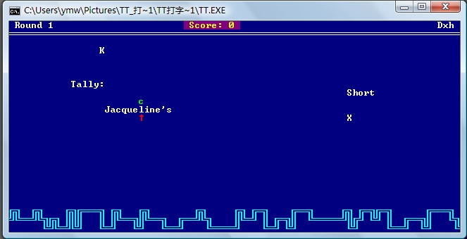
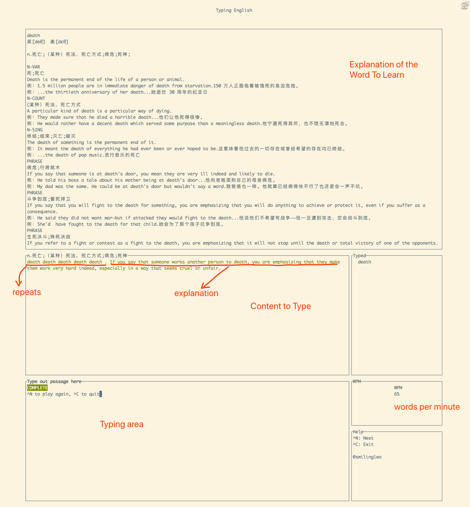

# Typing English -- 打字背单词

在很久很久以前，当我们刚刚开始接触计算机的时候，最先开始练习的就是打字。记得当时有一个很小但很经典的软件"TT打字", 以游戏的方式练习打字。玩着玩着，就练成一双<ruby>快手<rt>kuai shou</rt></ruby>。



而英语作为第二语言，日常也需要慢慢积累词汇量。在漫漫背单词之路上，[Anki](https://apps.ankiweb.net/)绝对是最佳记忆辅助软件。但是Anki记忆的时候基本只是视觉记忆，做为键盘侠，最终还是需要把单词敲出来。结合TT的灵感，就有了本软件。

## 简介

Typing English就是在cli下通过打字来记忆英语单词的小软件。 内置了一个[柯林斯词汇卡](https://ankiweb.net/shared/info/1882930552)，对应文件为`asserts/collection.anki2`。



缺省模式为随机模式，就是随机从词典中选取单词，每个单词重复5次，然后附上该单词的英英解释。

可以通过`--sequential`参数进入顺序记忆模式，通过`--from <word>`来指定从哪个单词开始背。

如果只希望背特定几个单词，也可以用`--words`模式，比如：`--words abate,abut,bawl`, 这样你就可以重复背这几个单词了。

每次打完一个单词，`Ctrl+N`继续下一个。

你可以一边背，一边看自己的打字WPM，值越高说明你对这个单词越熟练。

**一个小技巧**: 你可以在电脑上背Anki的时候，左半屏显示Anki，右半运行本软件。在背的过程中将不熟悉的单词添加到`--words`模式的列表中，背完之后用打字来加强一下肌肉记忆，效果加倍！

## 运行

```
cargo build --release
./target/release/typing-english -h
Terminal Typing English, memorize English vocabulary by typing. 0.1
Leo Liu <leo.wei.liu@gmail.com>

USAGE:
    typing-english [FLAGS] [OPTIONS]

FLAGS:
        --sequential    Sequentially show the words, not randomly
        --word-only     Only type the word, no explanation.
    -h, --help          Prints help information
    -V, --version       Prints version information

OPTIONS:
    -d, --deck-path <ANKI_DECK>    Specify the anki deck file path. [default: /Users/lliu/github/typing-
                                   english/asserts/collection.anki2]
        --from <FROM>              In sequential mode, which word to start with [default: a]
    -r, --repeat <REPEAT>          How many times a English word repeats [default: 5]
        --speed <SPEED>            If your typing speed is lower than this value, you have to restart typing this word.
                                   [default: 20]
    -w, --words <WORDS>            Specify words you want to type, separate by comma [default: ]
```

## TODOs

本软件是个Rust练手项目，从[typeracer](https://gitlab.com/DarrienG/terminal-typeracer)获得灵感。很多~~功能~~设想还都没有实现，比如：

- [ ] 将Anki Deck数据库封装为HTTP API
- [ ] 实现Anki遗忘算法
- [ ] ....

欢迎有兴趣的朋友提交PR。
